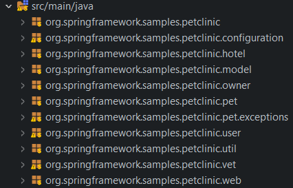
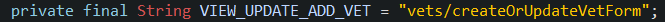
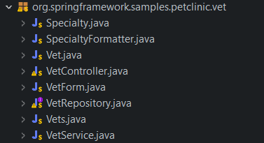
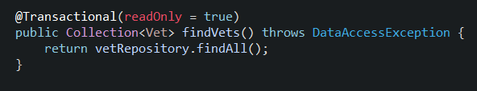

#
# Informe técnico de la metodología y la gestión de la configuración

#
## **Grupo G6.61**

Integrantes

_Manuel González_

_Fernando José Mateos_

_Miguel Ángel Roldán_

_Olegario Morato_

_Isabel María Martín_

_Samuel Albalat_

## ÍNDICE

[1. Introducción 2](#_hohjtsklci24)

[2. Estándares de Código 2](#_jmhajjv6c3w6)

[3. Política de mensajes de commit 3](#_gmoye6w9s4sc)

4[. Estructura de los repositorios y ramas por defecto 4](#_ln7utkmzdkiq)

5[. Branching strategy, basadas en Git Flow e incluyendo peer reviews 4](#_nqewzr49jya0)

6[. Desarrollo en ramas feature 4](#_k2x7cl80z42m)

7[. Preparación del despliegue 5](#_edywamrxtwai)

8[. Cómo solucionar bugs en producción 5](#_xz46azgjxca7)

9[. Política de versiones 5](#_66v958dp6ifs)

## Introducción

El actual documento describe todas las convenciones que se han decidido y en la que se va a basar todo el proyecto.

Describe cómo se escribirá el código, los mensajes de commits, nomenclatura y estructura de ramas, de versiones y cómo se realizará el despliegue.

## Estándares de Código

Se utilizará el estándar de código establecido por convención en el lenguaje java:

## Paquetes

Los nombres de los paquetes se escribirán en inglés.

Deben seguir el formato CamelCase con la primera letra minúscula.

Deberán nombrarse de la siguiente forma:

**org.springframework.samples.petclinic.\<nombre\>**

## Clases

Los nombres de clases se escribirán en inglés.

Deben seguir el formato CamelCase con la primera letra mayúscula.

## Funciones y variables

Los nombres de las funciones y las variables se escribirán en inglés.

Las variables y funciones deben ser nombradas en minúsculas y las palabras separadas por una letra mayúscula al estilo del nombrado camelCase.

## Constantes

Las constantes deben ir siempre en mayúsculas separando las palabras con guiones bajos.

## Indentación

La indentación del código se realizará mediante el uso del tabulador.

##

## Política de mensajes de commit

La estructura de mensajes de commit será la siguiente y se escribirá en castellano:

**\<Tipo\>[!]: \<Título\>**

**[Cuerpo]**

**[Pie]**

Los tipos de commit que utilizamos son los siguientes:

- **feat** : Desarrollo de una nueva funcionalidad
- **fix** : Corrección de alguna funcionalidad
- **docs** :Creación de nuevo documento
- **release** : Despliegue de nueva versión
- **style** : Modificación de hoja de estilos
- **test** : Tarea de testing

En caso de que se hayan añadido cambios importantes en el commit, se añadirá el símbolo "!" tras el tipo.

El título coincidirá con el nombre y número de la issue de Github. El primer carácter del título debe ir en mayúscula.

El cuerpo será opcional y debe describir lo desarrollado y el por qué del commit. Las líneas del contenido no deben tener más de 72 carácteres a fin de que no se trunque y se pierda información. Si es más largo habría que incluir saltos de línea de tamaño inferior a esos 72 caracteres.

El pie será opcional, aunque recomendable, y hará referencia al issue tratado, así como al estado de éste de la siguiente forma:

**\<Tipo\>#\<Nº issue\>**

Siendo el tipo:

- Refs: Para referenciar una issue que no está terminada.
- Fixes: Para cerrar una issue mediante el commit.

## Estructura de los repositorios y ramas por defecto

Nuestro repositorio del proyecto seguirá la siguiente estructura:

- "src". Carpeta contenedora de los archivos java del proyecto.
  - "main".
    - "Appengine". Aquí encontraremos archivos correspondientes al despliegue del proyecto.
    - ".../petclinic". El proyecto de ejemplo de spring que usaremos como base.
    - "less". Archivos de estilo de la página web.
    - "resources". Archivos estáticos que serán enviados por el servidor web.
    - ".../WEB-INF". Archivos de la arquitectura JSP.
  - "test". Aquí se encontrarán los tests automatizados del proyecto.
- "docs". Carpeta conteniendo todos los documentos de relevancia para el entregable.
- Encontraremos además en la carpeta base otros archivos de texto importantes, tales como el pom.xml o readme.md.

En cuanto a las ramas principales por defecto, tendremos una **rama principal "master"**. A partir de esta rama obtenemos la **segunda rama principal, "develop"**. La rama master contendrá todas las releases terminadas y revisadas. A su vez, la rama "develop" contendrá el código referente al desarrollo que no esté listo para release, ya sea por falta de funcionalidades, un testing lo suficientemente extensivo o cualquier motivo que el equipo estime oportuno.

## Branching strategy, basadas en Git Flow e incluyendo peer reviews

Como se ha comentado en el punto anterior, se usará **Git Flow** basado en dos ramas principales: **main** y **develop**.

En el desarrollo de una feature, al terminar se creará una **Pull Request** a un compañero hacia la rama, la cual se revisará y aceptará o denegará.

## Desarrollo en ramas feature

Por cada nueva feature, se generará una nueva rama a partir de **develop** , llamada **"feature-\<Número de issue\>"**.

Al terminar de desarrollarse, se generará una **Pull Request a Develop** , otro usuario que no haya estado trabajando en esa rama hará la revisión y cuando esté correcto, se hará un merge a Develop.

**Las ramas no se borrarán** en ningún momento.

## Preparación del despliegue

Para el despliegue se abrirá una nueva rama a partir de **develop** y nombrándola como **release-version**. En esta rama se podrán **solventar bugs menores** , además de añadir **cambios de última hora** que se consideren necesarios. Una vez terminado el trabajo con la rama se realizará un **merge** con las ramas **main** y **develop** para continuar con el desarrollo de la siguiente versión.

## Cómo solucionar bugs en producción

El procedimiento que se ha considerado para tratar bugs que surjan en producción consiste en crear una rama denotada como **bugfix**.

Para ello se seguirán los siguientes pasos:

1. Se creará una issue en GitHub que recopile los diferentes errores encontrados.
2. Se creará una rama desde main llamada **"bugfix-\<Número de issue\>"**.
3. Al solucionar todos los errores y tras haber sido revisados por otro miembro del equipo, se hará Pull Request sobre la rama **main** y **develop**.

En caso de que el fallo esté **solamente en la rama develop** , se podrá crear una ramabugfixdesde la propia rama develop y que solo afecte a esta rama, pero recomendamos que en su lugar se usen las ramas creadas para las tareas afectadas.

## Política de versiones

En cuanto a las versiones de la aplicación seguiremos la siguiente semántica:

**X.Y.Z**

Donde X es para versiones con cambios mayores, que rompan la compatibilidad con versiones o APIs anteriores. El segundo número, Y, indica versiones con cambios menores que no rompan la compatibilidad y que incluyan funcionalidad o incrementos sustanciales. Por último la Z sería para parches que arreglan errores, para arreglar comportamientos incorrectos de la aplicación.