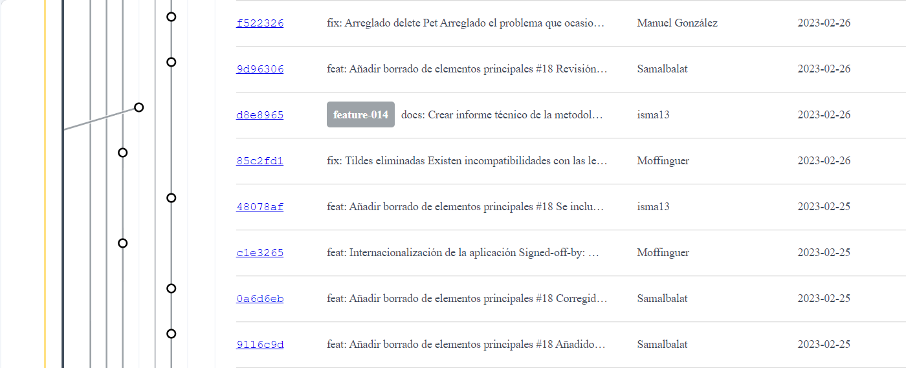

# Informe Técnico de la Historia del Proyecto

## **Grupo G6.61**

Integrantes

_Manuel González_

_Fernando José Mateos_

_Miguel Ángel Roldán_

_Olegario Morato_

_Isabel María Martín_

_Samuel Albalat_

## **ÍNDICE**

[1. Introducción](#introducci-n)

[2. Consideraciones iniciales](#consideraciones-iniciales)

[3. Historia del proyecto](#historia-del-proyecto)

[4. Conflictos encontrados y soluciones](#conflictos-encontrados-y-soluciones)

[5. Línea temporal de los commits realizados](#l-nea-temporal-de-los-commits-realizados)

[6. Ventajas e inconvenientes del uso de una estrategia de ramas](#ventajas-e-inconvenientes-del-uso-de-una-estrategia-de-ramas)

[7. Definición de Hecho](#definici-n-de-hecho)

[8. Conclusiones](#conclusiones)

## Introducción

En este informe se documenta la historia del proyecto, es decir, el cómo se ha asignado, desarrollado y terminado las tareas. Además podemos encontrar un esquema de las ramas y commits y como se ha trabajado con ellos.

## Consideraciones iniciales

El equipo ha previsto que, al no poder utilizar ninguna estrategia de ramas en las anteriores tareas, podría haberse producido algún conflicto con el trabajo de los compañeros. Por ello, hemos decidido hacer nuestras tareas por turnos de forma que, al terminar alguno de nosotros una tarea, el siguiente miembro del equipo fuese el encargado de revisar posibles errores y continuar con sus tareas correspondientes.

## Historia del proyecto

Creamos inicialmente todas las tareas en Github. A las tareas más sencillas, cómo la modificación del fichero pom.xml y correcciones de estilos, les asignamos un desarrollador a cada una. Y a las tareas de desarrollo más complejas asignamos un par de desarrolladores por tarea con la idea de que ambos trabajen con la tarea y se encarguen de revisar el código del otro.

Una vez terminada la tarea, la pasamos a "In Review" y creamos un Pull Request de la misma. Otros desarrolladores distintos a quién realiza la tarea, se descargan la rama, la prueban y hacen comentarios en el Pull Request indicando si es preciso corregir algo o bien está correcta.

Una vez corregida y revisada se chequea y se hace merge de esa rama a la rama develop.

## Conflictos encontrados y soluciones

Al intentar hacer el merge del pull request de la feature 12 en develop, encontramos un conflicto causado por estar esta rama varios commits por detrás de develop. Evaluamos 2 soluciones, hacer pull en la rama desde nuestro directorio de trabajo y resolver el conflicto ahí, o resolverlo directamente desde github. Se ha optado por la segunda opción, aunque más tarde nos dimos cuenta de que hubiera sido mejor la primera, dado que al no haber comprobado el resultado del código tras resolverlo, no conseguimos identificar que había un pequeño fallo en el proceso.

## Línea temporal de los commits realizados

###

 

 
 

 

###

## Ventajas e inconvenientes del uso de una estrategia de ramas

En la siguiente tabla se muestran las ventajas e inconvenientes encontrados en base a la experiencia adquirida durante el desarrollo del sprint sobre el uso de estrategia de ramas:

| **VENTAJAS** | **INCONVENIENTES** |
| --- | --- |
| Permite trabajar en paralelo, lo cual agiliza mucho el proceso de desarrollo ya que cada miembro puede trabajar sin molestar a otro de manera general. | Si las ramas tocan módulos comunes pueden producirse conflictos entre las ramas afectadas. |
| Las revisiones antes de confirmar un merge ayuda a los miembros del equipo a entender que ha hecho otro compañero. Esta práctica es buena pues podemos aprender mucho de tareas a las que no estamos tan acostumbrados pero que sí lo están otros miembros. | Si no se tiene un seguimiento del proyecto pueden acumularse pull request y puede estorbar a tareas futuras que dependen de las funcionalidades pendientes de ser aceptadas en su pull request. |
| Gracias al uso de una nomenclatura adecuada se hace muy sencillo el identificar las tareas | Si existen tareas muy pequeñas resulta más difícil crear una rama específica para su desarrollo en lugar de realizarla sobre la rama develop directamente. |

## Definición de Hecho

Se considerará "hecho" cuando la tarea haya terminado y se haya hecho una pull request hacia develop, revisada y aceptada por un compañero ajeno a la tarea.

## Conclusiones

Las estrategias de ramas han demostrado ser muy útiles para conseguir un desarrollo conjunto estable y óptimo. Además el equipo ha asimilado la importancia de una buena comunicación para la resolución de conflictos.